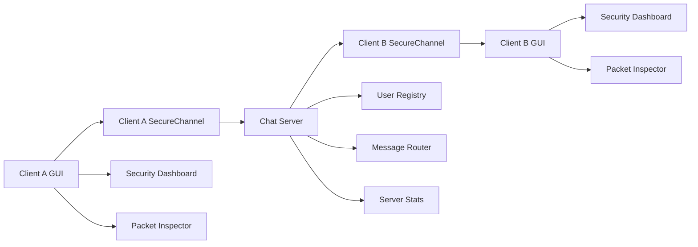
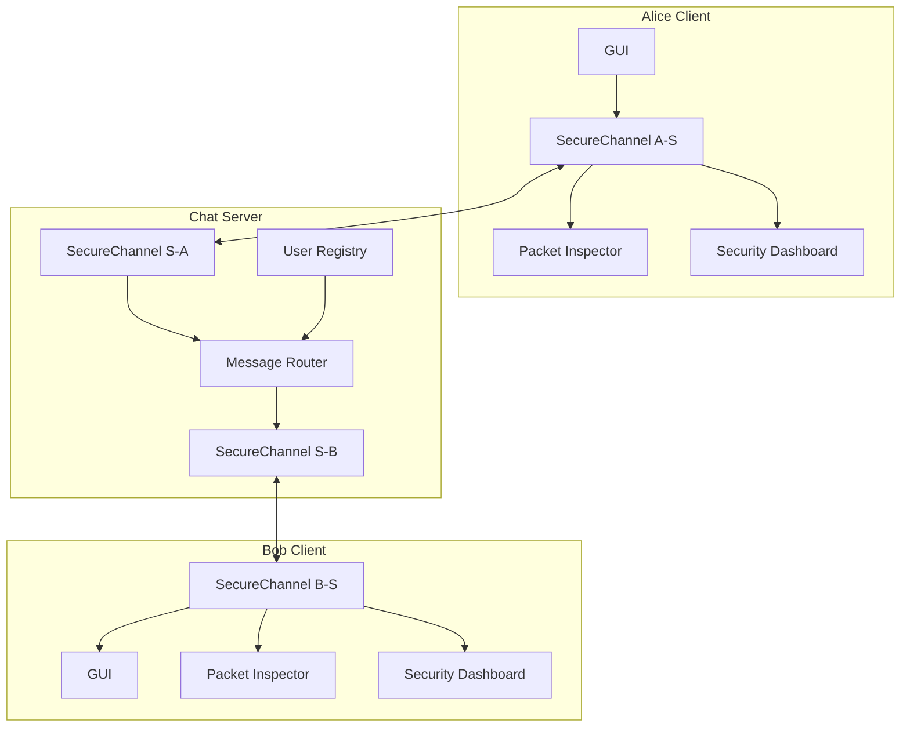
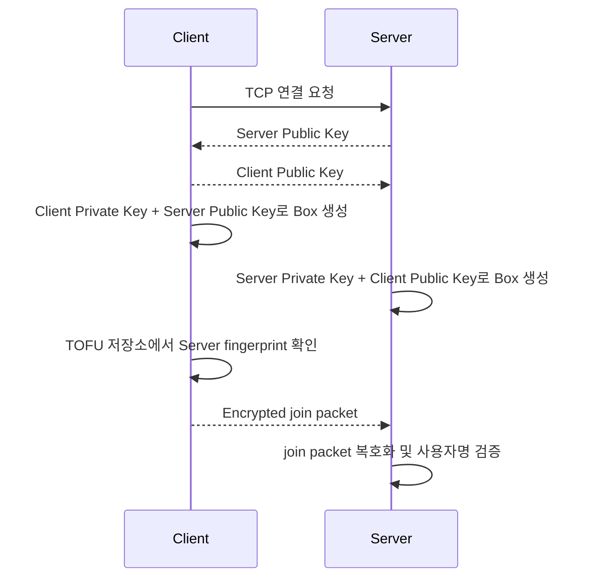
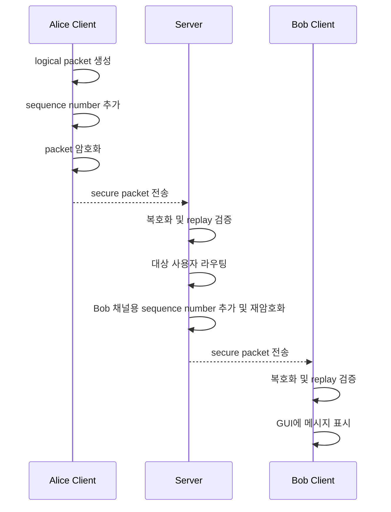
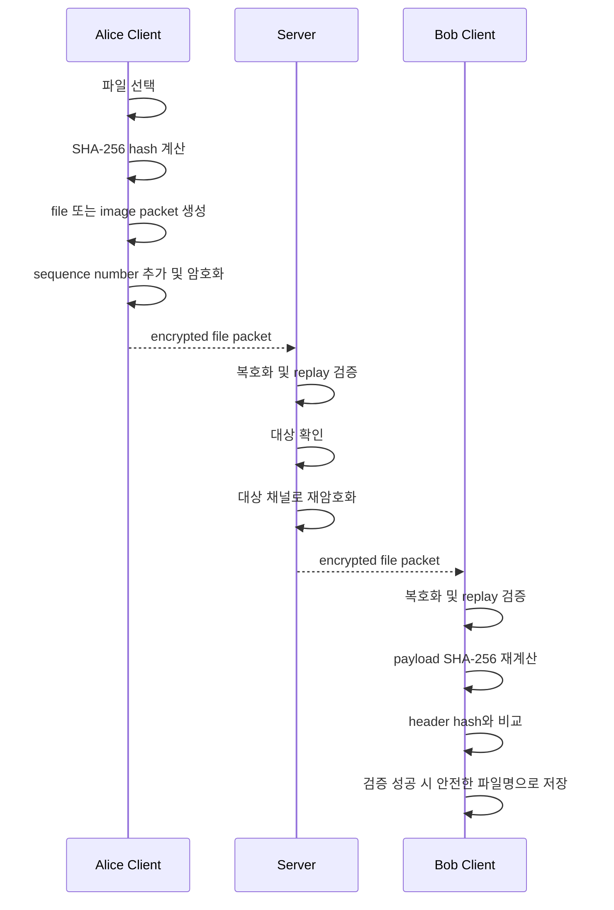

# Architecture

## 1. 전체 시스템 개요

SecureSocketChat은 중앙 서버가 접속자 목록과 메시지 라우팅을 담당하는 클라이언트-서버 구조입니다. 각 클라이언트는 서버와 독립적인 PyNaCl `Box` 기반 암호화 채널을 만들고, 채팅 메시지와 파일 payload를 자체 패킷 프로토콜로 주고받습니다.

현재 구조는 클라이언트-서버 간 암호화 채널입니다. 서버는 메시지를 라우팅하기 위해 각 클라이언트와의 암호화 채널에서 메시지를 복호화한 뒤, 대상 클라이언트의 채널로 다시 암호화해 전송합니다.

## 2. 주요 구성 요소

| 구성 요소 | 구현 위치 | 역할 |
|---|---|---|
| GUI Client | `secure_chat/gui.py` | Tkinter 화면, 접속자 목록, 채팅 입력, 이미지/파일 전송 버튼, 보안 상태 표시 |
| ChatClient | `secure_chat/client.py` | 서버 연결, 공개키 교환, 송수신 스레드, 메시지 queue 처리 |
| SecureChannel | `secure_chat/crypto_channel.py` | PyNaCl 공개키 교환, 암호화/복호화, sequence number 기반 replay 검증 |
| ChatServer | `secure_chat/server.py` | 다중 클라이언트 접속 관리, 사용자 등록, 채팅/귓속말/파일 라우팅 |
| Protocol | `secure_chat/protocol.py` | 4-byte length prefix, JSON header, binary payload framing |
| File Transfer | `secure_chat/file_transfer.py` | 파일 header 생성, SHA-256 계산, 파일 크기 표시, 위험 확장자 감지 |
| Trust Store | `secure_chat/trust_store.py` | TOFU 기반 서버 fingerprint 저장 및 변경 감지 |
| Packet Inspector | `secure_chat/packet_inspector.py` | 암호화 전 logical packet과 암호화 후 transport packet의 안전한 요약 생성 |

## 3. 클라이언트-서버 암호화 채널 구조

각 클라이언트는 서버와 직접 암호화 채널을 구성합니다. Alice와 Bob이 대화하더라도 Alice-Bob 사이에 직접 암호화 채널이 만들어지는 구조는 아닙니다.

## 4. 키 교환 흐름

서버와 클라이언트는 TCP 연결 이후 공개키를 교환하고, 각자 보유한 private key와 상대 공개키로 PyNaCl `Box`를 생성합니다. 이후 join packet부터는 암호화된 secure packet으로 전송됩니다.

TOFU 검증은 서버 공개키 fingerprint를 host:port 단위로 비교합니다. 최초 접속 자체를 절대적으로 보장하는 인증기관 기반 검증은 아니며, 자세한 한계는 [Security Notes](security-notes.md)와 [Threat Model](threat-model.md)에 정리되어 있습니다.

## 5. 메시지 전송 흐름

일반 채팅과 귓속말은 같은 암호화 채널 구조를 사용합니다. 클라이언트가 만든 logical packet에는 SecureChannel이 sequence number를 추가하고, 수신 측은 복호화 후 replay 여부를 검증합니다.

Packet Inspector는 이 과정에서 logical packet type, sequence, payload size, encrypted packet size, ciphertext preview 같은 요약 정보를 표시합니다. 메시지 전문, 전체 암호문, 파일 binary는 표시하지 않습니다.

## 6. 파일 전송 및 무결성 검증 흐름

이미지와 일반 파일은 binary payload를 사용합니다. 송신자는 payload의 SHA-256 해시를 header에 포함하고, 수신자는 payload를 다시 해시해 header 값과 비교합니다.

파일명은 저장 전에 정규화해 path traversal 가능성을 줄입니다. SHA-256 검증은 전송 중 payload 변경 여부를 확인하는 용도이며, 파일 내용 자체가 안전하다는 의미는 아닙니다.

## 7. 서버의 역할과 한계

| 항목 | 설명 |
|---|---|
| 접속 관리 | 클라이언트별 socket과 SecureChannel을 관리하고 중복 사용자명을 차단합니다. |
| 라우팅 | `chat`, `whisper`, `image`, `file` packet을 대상 사용자 또는 전체 사용자에게 전달합니다. |
| 재암호화 | 수신 클라이언트 채널에서 복호화한 뒤 대상 클라이언트 채널로 다시 암호화합니다. |
| 통계 | uptime, 접속자 수, 메시지/이미지/파일 전송량을 집계합니다. |
| 한계 | 서버가 라우팅 과정에서 메시지와 파일 metadata를 복호화하므로 서버를 신뢰 경계 안에 둡니다. |

이 한계 때문에 현재 구현을 서버가 메시지 내용을 볼 수 없는 구조로 설명하면 안 됩니다. 이 프로젝트의 보안 목표는 네트워크 구간에서 평문 노출과 비정상 패킷 처리 위험을 줄이는 데 있습니다.

## 8. 향후 확장 방향

| 확장 방향 | 설명 |
|---|---|
| 서버 키 영속화 | 재시작 후에도 동일 fingerprint를 유지해 TOFU 경고를 더 의미 있게 만들 수 있습니다. |
| 키 핀닝 또는 인증서 검증 | 최초 접속 신뢰 문제를 줄이고 서버 인증을 강화할 수 있습니다. |
| 실험적 E2E 모드 | 서버가 메시지 내용을 복호화하지 않는 별도 통신 구조를 실험할 수 있습니다. |
| 파일 전송 정책 고도화 | 확장자 차단, 다운로드 승인, 저장 위치 정책을 더 세밀하게 만들 수 있습니다. |
| 관찰 도구 개선 | Packet Inspector와 보안 로그를 연동해 비정상 패킷 분석을 강화할 수 있습니다. |

## 관련 문서

| 문서 | 내용 |
|---|---|
| [Protocol](protocol.md) | raw packet, secure packet, header/payload 규칙 |
| [Security Notes](security-notes.md) | 적용한 보안 요소와 한계 |
| [Threat Model](threat-model.md) | 보호 대상, 공격 시나리오, 대응 방식 |
| [Testing](testing.md) | 단위/통합 테스트 구조와 수동 확인 항목 |
| [CI](ci.md) | GitHub Actions 품질 검사 구성 |
| [Demo](demo.md) | CLI 원클릭 데모 실행 흐름 |
